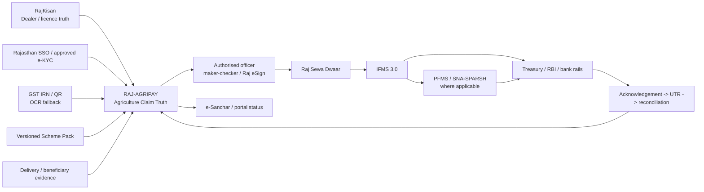
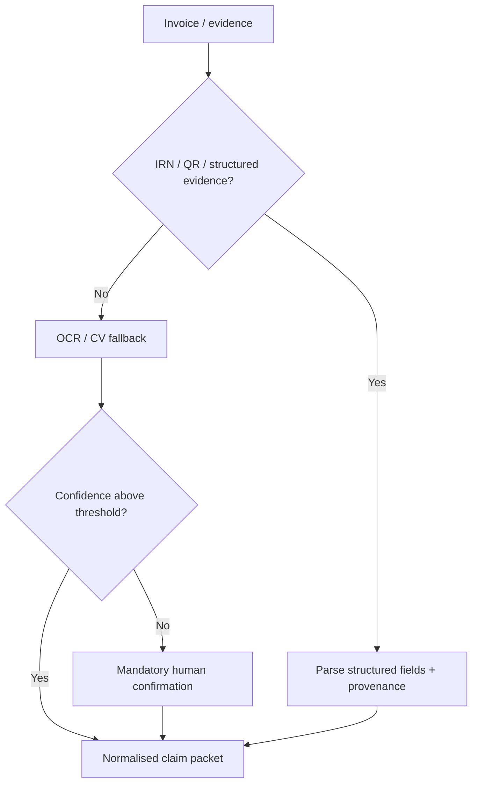
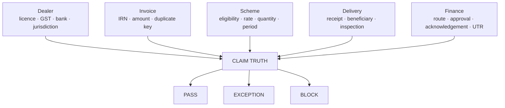
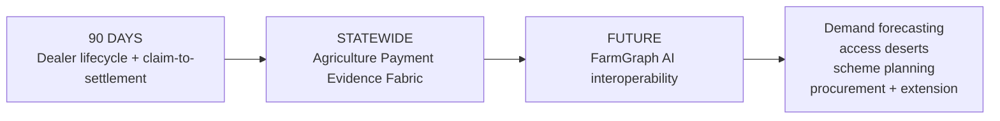

# RAJ-AGRIPAY

### Rajasthan Integrated Dealer Lifecycle, Claim & Settlement Fabric

> **One Dealer. One Claim. One Ledger. One Settlement Journey.**

**Challenge:** Integrated Dealer Management System - Dealers' Billing, Payments, Onboarding & Renewals  
**Applicant:** Syntheon Tech Private Limited · Jaipur, Rajasthan  
**iStart:** `3B9D9E48` · **CIN:** `U63120RJ2025PTC100649` · **DPIIT:** `DIPP213187`  
**Release:** Functional evaluator prototype · Next.js 16.3.2 · **Vercel production build GREEN, 27 Aug 2026**

---

## Start here: a working operations prototype, not a pitch page

`/` redirects directly to `/dashboard`.

The evaluator lands inside **Agriculture Finance Operations**: dealer-payment work queues, SLA health, exceptions, claim/payment state, district MIS, scheme controls, integration truth and reconciliation. A single **Evaluator Console** provides judge-controlled GREEN / AMBER / RED scenarios without hiding the underlying officer workflow.

| Proof journey | Route / surface | What it proves |
|---|---|---|
| Officer operations | `/dashboard` | claim queue, SLA, exception ownership, district MIS, finance handoff and claim-to-UTR closure |
| Dealer onboarding / renewal | `/onboarding` | authorised identity boundary, RajKisan licence context, IFMS payee mapping, Dealer Passport and Payment Identity Lock |
| Invoice -> Claim Truth | `/intake` | IRN/QR-first extraction, OCR fallback, confidence review and deterministic PASS / EXCEPTION / BLOCK |
| Impact & Payback Lab | `/impact` | editable TAT, working-capital and administrative-value scenario model |
| Statewide vision | `/vision` | 90-day deployment -> Agriculture Payment Evidence Fabric -> future FarmGraph AI interoperability |
| Dealer communications | Evaluator Console | source-state-bound portal/e-Sanchar-ready communication examples; no premature payment-success message |
| SUTRA Dealer Edge | Dashboard -> SUTRA | multilingual assisted capture, offline sealed packet and authorised sync; never offline expenditure approval |

**Evaluation data is deterministic/synthetic. Protected Government connectors are never silently represented as LIVE.**

---

# The problem we are actually solving

The challenge is not merely “build a dealer portal.” Rajasthan already has important authoritative systems. The operational gap is the missing **Agriculture-specific evidence and orchestration layer** across dealer identity, invoices, scheme rules, approvals, finance routing, dealer status and reconciliation.

The challenge identifies:
- T+15-T+30 settlement delays and dealer cash-flow strain;
- paper/manual invoice verification;
- fragmented scheme-wise systems and ledgers;
- limited payment visibility for dealers and auditors;
- reconciliation mismatches and delayed account closure;
- need for e-KYC, OCR, rule-driven workflow, PFMS/GST linkage, MIS, alerts and rapid scheme onboarding.

A generic login + OCR + payment button would duplicate existing Government capabilities and still leave Agriculture claim truth unresolved.

> **IFMS moves public money. RAJ-AGRIPAY proves why an Agriculture dealer claim is ready to move, routes it correctly, and closes the evidence loop after it moves.**

---

# Architecture: evidence before expenditure



### Non-negotiable authority boundary

- AI may extract, explain, compare and prioritise; **AI does not approve public expenditure**.
- SUTRA may capture and queue evidence offline; **SUTRA does not approve expenditure offline**.
- Payment success is shown only after an authoritative source acknowledgement.
- RAJ-AGRIPAY does not hold Government money and does not create a parallel wallet/payment network.

---

# Why this is materially more innovative than an OCR portal

## 1. Federated Dealer Passport
A reusable Agriculture dealer identity layer references source-owned truth instead of creating another vendor master:
- RajKisan licence/lifecycle reference;
- SSO/approved e-KYC reference;
- GSTIN/legal-name context;
- IFMS payee mapping;
- scheme memberships;
- renewal/expiry state;
- versioned payment profile.

### Payment Identity Lock
A sensitive bank-account change triggers re-verification, maker-checker and a new version. Historical claims retain the exact payment-profile version used at approval.

## 2. Structured evidence before OCR
> **Do not OCR what Government already made machine-readable.**



## 3. Claim Truth Graph
Dealer + invoice + scheme + delivery + finance facts are joined into deterministic controls. Outcomes are **PASS / EXCEPTION / BLOCK** with reason code, owner and next action - not a black-box “fraud probability.”



## 4. Effective-dated Scheme Packs
New schemes reuse identity, evidence, workflow, finance and reconciliation primitives. Policy is versioned configuration with maker-checker, test pack and effective date; old claims replay against the rule version that actually applied.

## 5. Claim-to-UTR lineage
Dealer -> claim -> invoice -> Scheme Pack -> approval -> finance route -> source acknowledgement -> UTR -> reconciliation becomes one audit trail.

---

# Judge-controlled functional scenarios

Open **Evaluator Console** from `/dashboard`.

### GREEN - clean claim
`AGR-26-10482`

`12/12 checks -> human approval -> Finance -> simulated source acknowledgement -> demo UTR -> reconciliation`

### AMBER - recent bank-profile change
`AGR-26-10479`

`Payment Identity Lock -> maker-checker re-verification -> clean lane -> approval -> acknowledgement -> reconciliation`

### RED - duplicate invoice
`AGR-26-10481`

`exact duplicate reference -> DUPLICATE_INVOICE_REFERENCE -> deterministic finance BLOCK -> evidence provenance`

Every scenario shows what the step proves, offers manual next-proof controls and can reset to the deterministic baseline.

---

# Rajasthan-native integration posture

| Rail | Role | Evaluator state |
|---|---|---|
| RajKisan | Agriculture dealer/licence truth | `CONTRACT-READY` |
| Rajasthan SSO | dealer/officer identity | `CONTRACT-READY` |
| Raj Sewa Dwaar | approved State integration gateway | `CONTRACT-READY` |
| IFMS 3.0 | State vendor/payment processing | `CONTRACT-READY` |
| PFMS / SNA-SPARSH | applicable CSS route | `CONTRACT-READY` |
| GST e-Invoice / IRP | structured invoice evidence | `SANDBOX` |
| Raj eSign | authorised approval signing | `CONTRACT-READY` |
| e-Sanchar 3.0 | dealer notifications / Push SMS | `CONTRACT-READY` |
| BHASHINI | Hindi/regional language ASR/TTS/translation | `ADAPTER-READY` |
| SUTRA-ID Edge | optional assisted edge evidence capture | `PROTOTYPE-PROVEN` |

`LIVE` is reserved only for a production connector that is actually authorised, connected, verified and monitored.

---

# Statewide MIS: not a decorative map

The Rajasthan view is an operational workload surface: dealer coverage, claims, represented value, exception count, validation latency and action priority. Evaluator values are synthetic. Production replaces them with authorised Rajasthan master/GIS data and live operational telemetry.

It answers one question:

> **Where is money stuck, for which dealer/scheme, why, who owns the exception, and what clears it?**

---

# SUTRA-ID Edge + BHASHINI

SUTRA is optional; RAJ-AGRIPAY remains web/PWA-first.

Where district offices, camps or low-connectivity contexts need assisted service:

`camera evidence -> Hindi/BHASHINI-ready guidance -> local quality checks -> human confirmation -> encrypted/idempotent queue -> signed local receipt -> authorised sync`

This is an access/resilience advantage, not a hardware dependency and never a payment-authority bypass.

---

# 90-day Government pilot

| Window | Acceptance gate |
|---|---|
| Day 0-10 | AS-IS mapping, open-obligation inventory, interface register, baseline TAT/reconciliation effort |
| Day 10-25 | Dealer Passport, licence/payee references, structured invoice path and OCR fallback |
| Day 25-45 | Scheme Packs, Claim Truth, duplicate/rate/quantity controls, exception workbench |
| Day 45-60 | State/CSS route resolver, Raj eSign, Raj Sewa Dwaar/IFMS/PFMS adapters, acknowledgement state machine, e-Sanchar |
| Day 60-75 | claim-to-UTR reconciliation, district MIS, optional SUTRA/BHASHINI workflow |
| Day 75-90 | security/accessibility, parallel replay, migration/cutover, UAT, SOPs, training, handover and statewide blueprint |

### Proposed pilot targets
- `<4h` median clean-claim departmental validation;
- `<=T+2 working days` clean claim to departmental approval;
- `100%` exact-key duplicate detection;
- `100%` claim/payment lineage coverage;
- `>=90%` eligible auto-reconciliation where authoritative references exist;
- `<30 sec` audit-packet retrieval;
- `0` synthetic external status represented as authoritative.

External Treasury/PFMS/bank settlement time is measured separately because RAJ-AGRIPAY does not claim to control it.

**Indicative 90-day implementation ask: INR 44.8 lakh**, subject to confirmed interfaces, State hosting/security requirements and taxes.

---

# Brownfield deployment, not a big-bang replacement

`inventory -> versioned source crosswalk -> parallel Claim Truth replay -> count/value reconciliation -> controlled cutover -> rollback-capable operation`

Government receives source/configuration, OpenAPI contracts, Scheme Pack and Claim Truth schemas, data dictionary, security controls, runbooks, migration reconciliation, UAT evidence, training materials, RACI, backup/DR design and statewide rollout plan.

- [`docs/MIGRATION_CUTOVER.md`](docs/MIGRATION_CUTOVER.md)
- [`docs/GOVERNMENT_HANDOVER.md`](docs/GOVERNMENT_HANDOVER.md)
- [`docs/RACI.md`](docs/RACI.md)
- [`docs/SECURITY_GOVERNANCE.md`](docs/SECURITY_GOVERNANCE.md)

---

# Statewide vision - ambitious, but bounded



Future FarmGraph interoperability can combine consented/authorised payment and input evidence with approved crop calendars, weather, soil, satellite/geospatial, drone and farm/IoT signals for planning intelligence. **None of those future connectors is represented as live in the evaluator release.**

---

# Execution credibility

Relevant documented Syntheon milestones include:
- **C-DAC / MeitY Blockchain India Challenge:** VYOM Trade Ledger selected for Proof-of-Concept phase;
- **IndiaAI Innovation Challenge 2026:** Nyaya Saarthi selected for Stage 2 / Pilot Stage after presentation and evaluation;
- **BHASHINI - Current AI VYOMA:** selected for a next-stage handheld-AI prototype sprint, with multilingual edge hardware/software execution.

These are execution signals, not endorsements of RAJ-AGRIPAY.

---

# Evidence pack

- [`docs/RESEARCH_EVIDENCE.md`](docs/RESEARCH_EVIDENCE.md) - Rajasthan/national infrastructure findings and design consequences
- [`docs/ARCHITECTURE.md`](docs/ARCHITECTURE.md) - control-plane and authority architecture
- [`docs/INTEGRATION_MATRIX.md`](docs/INTEGRATION_MATRIX.md) - connector readiness and production gates
- [`docs/SECURITY_GOVERNANCE.md`](docs/SECURITY_GOVERNANCE.md) - security, privacy and responsible-AI controls
- [`docs/90_DAY_PILOT.md`](docs/90_DAY_PILOT.md) - pilot gates and measurable outcomes
- [`docs/JUDGE_DEMO_4_MINUTES.md`](docs/JUDGE_DEMO_4_MINUTES.md) - evaluator choreography
- [`docs/EVALUATOR_OBJECTIONS.md`](docs/EVALUATOR_OBJECTIONS.md) - technical/procurement Q&A
- [`docs/SYNTHETIC_DATA_MANIFEST.md`](docs/SYNTHETIC_DATA_MANIFEST.md) - evaluation-data truth boundary
- [`openapi/raj-agripay.yaml`](openapi/raj-agripay.yaml) - contract-first API surface
- [`schemas/scheme-pack.example.json`](schemas/scheme-pack.example.json)
- [`schemas/claim-truth-packet.example.json`](schemas/claim-truth-packet.example.json)

---

# Build / release gate

```bash
npm install
npm run verify:static
npm run typecheck
npm run build
npm run dev
```

Runtime: **Node.js 22+**. Health endpoint: `/api/health`.

The current evaluator release has passed Vercel's production Next.js build path. GitHub Actions has separately exhibited a repository-level pre-job startup issue; application build truth is therefore taken from the executing Vercel release plus the in-repo static/type/build gates, not from a workflow that never starts.

---

## Submission doctrine

**No fake API. No autonomous expenditure. No invented UTR. No decorative AI. No parallel Government payment rail.**

RAJ-AGRIPAY wins by making Rajasthan's existing Agriculture + Finance ecosystem operate as one transparent, evidence-linked dealer settlement journey.