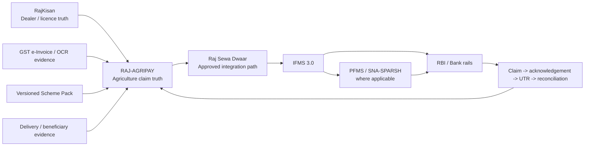
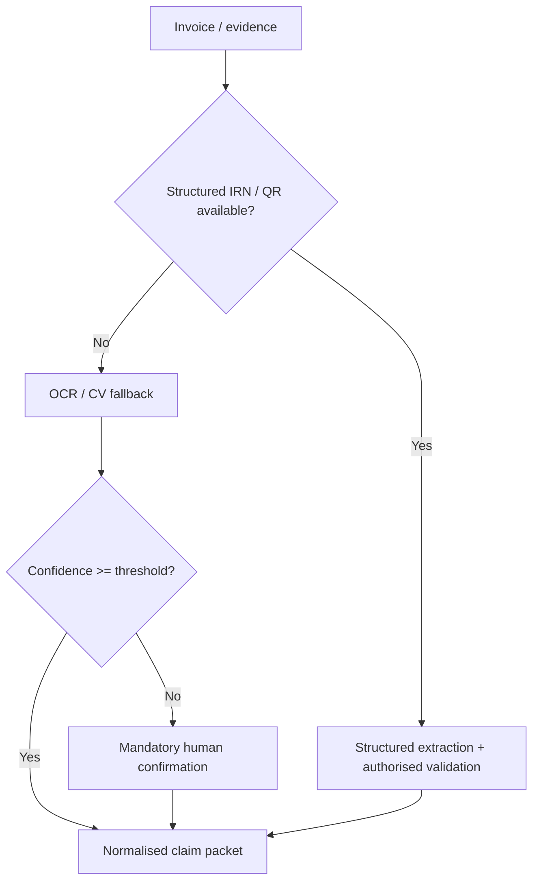
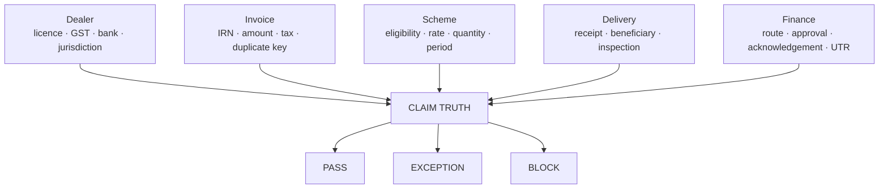
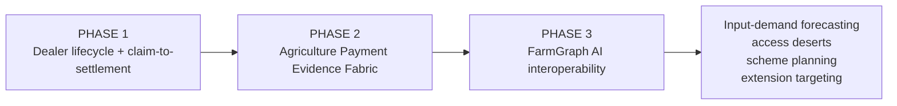

# RAJ-AGRIPAY

### Rajasthan Integrated Dealer Lifecycle, Claim & Settlement Fabric

> **One Dealer. One Claim. One Ledger. One Settlement Journey.**

**Challenge:** Integrated Dealer Management System - Dealers' Billing, Payments, Onboarding & Renewals  
**Applicant:** Syntheon Tech Private Limited · Jaipur, Rajasthan  
**iStart Registration:** `3B9D9E48` · **CIN:** `U63120RJ2025PTC100649` · **DPIIT:** `DIPP213187`  
**Repository:** https://github.com/Sauravssoni/RIC-Dealer-Management-System

---

## Start here - this is an operations product, not a pitch page

The base evaluator experience opens into **Agriculture Finance Operations**: work queues, scheme controls, dealer lifecycle, exception ownership, payment-state transitions, reconciliation, district MIS and Rajasthan-native integration readiness.

| Evaluator journey | Route / surface | What it proves |
|---|---|---|
| Officer operations | `/dashboard` | claim queue, SLA, exception ownership, district MIS, finance handoff, UTR/reconciliation |
| Dealer onboarding / renewal | `/onboarding` | e-KYC boundary, RajKisan licence context, IFMS payee mapping, Dealer Passport, Payment Identity Lock |
| Invoice -> Claim Truth | `/intake` | IRN/QR-first extraction, OCR fallback, confidence/human review, deterministic PASS / EXCEPTION / BLOCK |
| Impact & Payback Lab | `/impact` | editable TAT, working-capital and administrative-value scenario model |
| Dealer notifications | dashboard notification control | portal / SMS examples designed for e-Sanchar 3.0; never fake a payment-success event |
| SUTRA Dealer Edge | dashboard / SUTRA | camera + multilingual assisted capture, offline queue, signed receipt, authorised sync; no offline expenditure approval |

**Evaluation data is synthetic/deterministic. External Government APIs are never silently represented as LIVE.**

---

# Why the obvious solution is the wrong solution

Rajasthan is **not** starting from zero. IFMS 3.0 already owns generic vendor/payee and State finance functions. RajKisan already owns Agriculture dealer/licence workflows. PFMS/SNA-SPARSH, Treasury/RBI/banks and GST infrastructure remain sovereign systems of record.

A winning solution therefore should not build another vendor database, another wallet or another generic OCR portal.

**RAJ-AGRIPAY is the Agriculture-specific control plane between operational evidence and sovereign finance rails.**



### The sentence to remember

> **IFMS moves public money. RAJ-AGRIPAY proves why an Agriculture dealer claim is ready to move, routes it correctly, and closes the evidence loop after it moves.**

---

# Official problem -> clickable proof

| Official challenge requirement | RAJ-AGRIPAY response |
|---|---|
| T+15-T+30 settlement delay | straight-through clean-claim validation + owned exception queues + measurable Agriculture-side SLA |
| Fragmented scheme-wise systems | one federated Dealer Passport + canonical claim packet + cross-scheme ledger |
| Manual invoice verification | structured GST evidence first; OCR fallback only where needed |
| No digitised invoice-to-payment workflow | claim state machine from intake -> rule checks -> authorised approval -> finance -> acknowledgement -> UTR -> reconciliation |
| No real-time MIS | officer command centre + district operations + ageing / exception intelligence |
| Limited dealer transparency | grounded claim timeline + SMS/portal actions + Dealer Saarthi pattern |
| Reconciliation mismatch | claim-to-UTR lineage + reason-coded breaks + auto-reconciliation for eligible payments |
| e-KYC / Aadhaar-linked onboarding | authorised online route or compliant signed/offline verification; minimum-retention identity design |
| Renewals | versioned Dealer Passport lifecycle and licence-expiry workflow |
| Rule-based approvals | effective-dated Scheme Packs + deterministic Claim Truth Graph + maker-checker governance |
| PFMS / GST-linked settlement | contract-ready Finance handoff; IFMS/PFMS/Treasury remain authoritative |
| Low-cost / rapid scheme onboarding | reusable identity, evidence, workflow, notification, finance and reconciliation primitives; new scheme = governed configuration |

---

# Product architecture

## 1. Dealer Passport

A reusable Agriculture dealer identity layer referencing source-owned records rather than creating another generic vendor master.

- RajKisan licence / lifecycle reference
- SSO / approved e-KYC reference
- GSTIN / legal-name context
- IFMS payee mapping
- scheme memberships
- renewal / expiry state
- versioned bank-payment profile
- **Payment Identity Lock** for last-minute bank changes

## 2. Invoice Intelligence

> **Do not OCR what Government already made machine-readable.**



## 3. Claim Truth Graph

Every claim is evaluated as linked evidence domains instead of a black-box score.



Every non-pass has a reproducible reason code, owner and next action.

## 4. Scheme Rule Studio

New schemes should not require another application project.

`Draft -> automated test pack -> Maker -> Checker -> Effective date -> signed / hashed version`

Historical claims replay against the exact policy version that applied at transaction time.

## 5. Rajasthan-native rails

| Rail | Role | Evaluator state |
|---|---|---|
| RajKisan | Agriculture dealer / licence truth | `CONTRACT-READY` |
| Rajasthan SSO | dealer / officer identity | `CONTRACT-READY` |
| Raj Sewa Dwaar | approved State integration gateway | `CONTRACT-READY` |
| IFMS 3.0 | vendor/payee + financial processing | `CONTRACT-READY` |
| PFMS / SNA-SPARSH | applicable CSS route | `CONTRACT-READY` |
| GST e-Invoice / IRP | structured invoice evidence | `SANDBOX` |
| Raj eSign | authorised approval-signing path | `CONTRACT-READY` |
| e-Sanchar 3.0 | dealer notifications / Push SMS | `CONTRACT-READY` |
| BHASHINI | Hindi / regional ASR-TTS-translation | `ADAPTER-READY` |
| SUTRA-ID Edge | optional assisted offline evidence capture | `PROTOTYPE-PROVEN` |

**LIVE** is reserved for an authoritative production connector that is actually connected, verified and monitored.

---

# Statewide operations - not a decorative map

The district view is an **operational workload surface**: dealer coverage, claims, exceptions, represented value, validation TAT and action priority. Evaluator values are synthetic; production replaces them with authorised Rajasthan district/GIS master data and live claim telemetry.

The purpose of the map is not cartography. It answers a Finance/Scheme officer's question:

> **Where is money getting stuck, for which dealer/scheme, why, who owns the exception, and what action will clear it?**

---

# SUTRA-ID Edge - an asymmetric last-mile advantage

SUTRA is **optional**; the system remains web/PWA-first for dealers.

Where district offices, camps or low-connectivity contexts need assistance, SUTRA can provide:

`camera evidence -> Hindi/BHASHINI-ready guidance -> local quality checks -> human confirmation -> encrypted/idempotent queue -> signed receipt -> authorised sync`

### Hard authority boundary

- SUTRA **never** approves Government expenditure offline.
- AI **never** manufactures a payment acknowledgement.
- Government financial state changes only after source-backed authorised events.

---

# Vision - from Dealer Payments to a Rajasthan Agriculture Payment Evidence Fabric

The proposal remains laser-focused on the dealer-payment challenge. The architecture, however, is deliberately reusable.



### FarmGraph AI interoperability - future, not a current claim

A future consented signal layer can combine dealer-claim/payment events with authorised crop calendars, satellite/geospatial, weather, soil, farm/IoT and drone evidence to support:

- input-demand forecasting by crop cycle and district;
- dealer-network access-gap detection;
- scheme utilisation vs agronomic need;
- early procurement / distribution planning;
- extension-worker and camp targeting;
- farm-to-market / evidence-chain integration where authorised.

This is intentionally framed as **future interoperability**. RAJ-AGRIPAY does not claim live FarmGraph, satellite or farm-registry integrations in the evaluator release.

---

# 90-day Government pilot

| Window | Gate |
|---|---|
| Day 0-10 | AS-IS mapping, dealer/scheme inventory, interface register, baseline TAT/reconciliation effort |
| Day 10-25 | Dealer Passport, licence/payee references, structured invoice + OCR fallback |
| Day 25-45 | Scheme Packs, Claim Truth, duplicate/rate/quantity controls, exception workbench |
| Day 45-60 | State/CSS route resolver, IFMS/PFMS contract adapters, acknowledgement state machine, notifications |
| Day 60-75 | reconciliation, district MIS, Dealer Saarthi, optional SUTRA workflow |
| Day 75-90 | UAT, security/accessibility, migration/cutover, SOPs, training, handover and statewide blueprint |

### Pilot targets - proposals, not fabricated achieved results

- `<4h` median clean-claim departmental validation
- `<=T+2 working days` clean claim to departmental approval
- `100%` exact-key duplicate detection
- `100%` claim/payment lineage coverage
- `>=90%` eligible auto-reconciliation where authoritative references exist
- `<30 sec` audit-packet retrieval
- `0` synthetic external status represented as authoritative

External Treasury/PFMS/bank settlement time is reported separately because RAJ-AGRIPAY does not unilaterally control it.

**Indicative 90-day implementation ask: INR 44.8 lakh**, subject to confirmed interfaces, State hosting/security requirements and taxes.

---

# Brownfield deployment & Government handover

This is not a risky big-bang replacement.

`inventory -> source crosswalk -> parallel replay -> count/value reconciliation -> controlled cutover -> rollback-capable operations`

The handover pack includes source, OpenAPI contracts, Scheme Pack schemas, interface register, data dictionary, security controls, runbooks, migration reconciliation, UAT evidence, training material, RACI, backup/DR design and statewide rollout sequence.

See:

- [`docs/MIGRATION_CUTOVER.md`](docs/MIGRATION_CUTOVER.md)
- [`docs/GOVERNMENT_HANDOVER.md`](docs/GOVERNMENT_HANDOVER.md)
- [`docs/RACI.md`](docs/RACI.md)
- [`docs/SECURITY_GOVERNANCE.md`](docs/SECURITY_GOVERNANCE.md)

---

# Execution credibility

Syntheon is a DPIIT-recognised Rajasthan startup building repository-backed governed AI, edge systems, digital twins and evidence-linked public-sector workflows.

Documented programme milestones relevant to execution capability include:

- **C-DAC / MeitY Blockchain India Challenge** - VYOM Trade Ledger selected for the Proof-of-Concept phase.
- **IndiaAI Innovation Challenge 2026** - Nyaya Saarthi reached the Evaluation Committee / presentation stage.
- **BHASHINI - Current AI VYOMA** - selected for a next-stage handheld-AI prototype sprint, demonstrating multilingual edge hardware/software integration.
- Four **IICG Grant Challenge 2026** deep-tech proposals were formally acknowledged for review; these are cited only as submissions under review, not awards/selections.

Programme milestones demonstrate execution evidence only; they are not represented as endorsement of RAJ-AGRIPAY.

---

# Repository evidence pack

- [`docs/RESEARCH_EVIDENCE.md`](docs/RESEARCH_EVIDENCE.md) - Rajasthan / national infrastructure findings and design consequences
- [`docs/ARCHITECTURE.md`](docs/ARCHITECTURE.md) - control plane, evidence, state and authority design
- [`docs/INTEGRATION_MATRIX.md`](docs/INTEGRATION_MATRIX.md) - connector readiness and production gates
- [`docs/SECURITY_GOVERNANCE.md`](docs/SECURITY_GOVERNANCE.md) - finance-grade and responsible-AI controls
- [`docs/90_DAY_PILOT.md`](docs/90_DAY_PILOT.md) - rollout gates and measurable outcomes
- [`docs/JUDGE_DEMO_4_MINUTES.md`](docs/JUDGE_DEMO_4_MINUTES.md) - evaluator choreography
- [`docs/EVALUATOR_OBJECTIONS.md`](docs/EVALUATOR_OBJECTIONS.md) - challenge / procurement Q&A
- [`docs/SYNTHETIC_DATA_MANIFEST.md`](docs/SYNTHETIC_DATA_MANIFEST.md) - truth-labelled demo data boundary
- [`openapi/raj-agripay.yaml`](openapi/raj-agripay.yaml) - contract-first API surface
- [`schemas/scheme-pack.example.json`](schemas/scheme-pack.example.json) - governed rule-pack example
- [`schemas/claim-truth-packet.example.json`](schemas/claim-truth-packet.example.json) - evidence-packet example

---

# Run locally

```bash
npm install
npm run verify:static
npm run typecheck
npm run build
npm run dev
```

Runtime target: **Node.js 22+**. Health endpoint: `/api/health`.

> GitHub Actions in this private repository has been producing a repository-level `startup_failure` before job creation. That state is deliberately separated from application build truth; the source-level static gate is included in-repo and the deployment gate must still be proven on an executing runner/local environment before final production claim.

---

## Submission doctrine

**No fake API. No autonomous expenditure. No invented UTR. No decorative AI. No parallel Government payment rail.**

RAJ-AGRIPAY wins by making the existing Rajasthan Agriculture + Finance ecosystem operate as one transparent, evidence-linked dealer settlement journey.