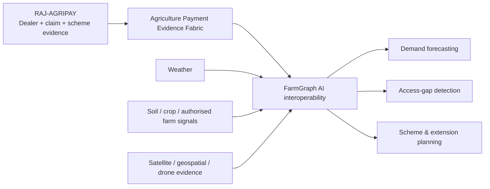

## RAJ-AGRIPAY Vision Roadmap

### Phase 1 - Challenge deployment: Dealer Lifecycle + Claim-to-Settlement

Deliver the exact problem statement: dealer onboarding/renewal, structured invoice/OCR capture, deterministic scheme rules, human approval, Finance handoff, status, notifications, reconciliation and audit.

### Phase 2 - Rajasthan Agriculture Payment Evidence Fabric

Reuse the same canonical Dealer Passport, Claim Truth Packet, Scheme Pack, exception taxonomy and claim-to-UTR lineage across Agriculture, Horticulture and Agriculture Marketing payment journeys where authorised.

### Phase 3 - FarmGraph AI interoperability

This is a **future interoperability layer, not a current evaluator integration**.

Consent-bound and authorised payment/input signals can become one input into a broader FarmGraph AI / agricultural digital-twin layer alongside approved crop calendars, weather, soil, satellite/geospatial, drone and farm/IoT evidence.

Potential planning outputs:
- district/crop-cycle input demand forecasting;
- dealer-network access deserts and last-mile coverage gaps;
- scheme utilisation versus agronomic need;
- procurement/distribution planning before seasonal peaks;
- extension-worker/camp targeting;
- evidence continuity from farmer need -> input supply -> scheme payment -> outcome measurement.

### Phase 4 - Public Expenditure Evidence Engine

After proving the Agriculture pilot, the same bounded architecture can be adapted to other Government vendor/dealer reimbursement domains without moving or holding Government money.

## Design boundary

Roadmap items are deliberately separated from the 90-day pilot acceptance scope. No future FarmGraph, satellite, IoT, drone or cross-department integration is represented as live in the evaluator release.
